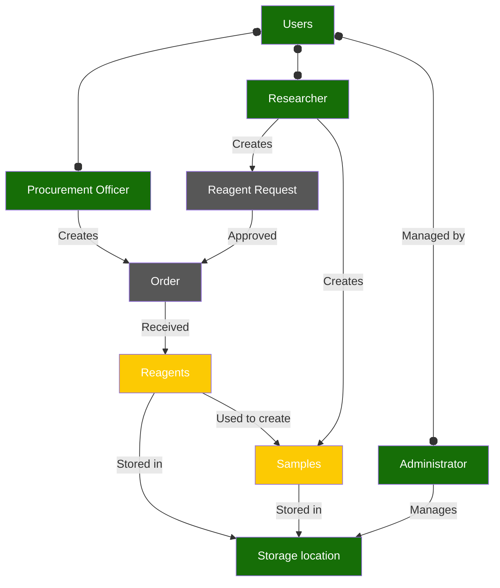

# Frontend Documentation

## Overview

This project is designed to manage users, reagents, samples, requests, orders, storage locations within a laboratory setting. It supports various user roles, each with distinct functionalities. The frontend is built using React and Redux Toolkit for state management, along with MUI for the UI components and RTK Query for data fetching and caching.

## Table of Contents
- [Getting Started](#getting-started)
- [Tools and Technologies](#tools-and-technologies)
- [Diagrams](#diagrams)

## Getting Started

1. Clone the repo to your local machine.
2. Make sure you have Node.js >= 20 and NPM >= 10 installed globally.
3. Install all necessary dependencies via `npm ci` command.
4. Create `.env.local` file using `.env.example` as an example.

### Local environment (frontend)

| command | description |
| ------ | ------ |
|`npm run dev`| to run local dev server. Dev server is setup to use 3000 port.|
|`npm run build`| to build a bundle.|
|`npm run preview`| to start the bundled app you have built.|
|`npm run typecheck`| to check types via Typescript compiler.|
|`npm run lint`| to run linter check.|
|`npm run lint:fix`| to fix reported problems automatically where possible.|
|`npm run stylelint`| to run linter check for stylesheets.|
|`npm run stylelint:fix`| to fix problems in stylesheets automatically where possible.|

### Local environment (backend)

To run backend app locally:
1. Clone this repo: [link](https://github.com/Quantori-Academy/apt-backend)
2. Follow the steps: [link](https://github.com/Quantori-Academy/apt-backend/blob/main/README.md)

## Tools and Technologies

This project utilizes the following tools and libraries:

- **React** for building the user interface.
- **Redux Toolkit** for state management and handling asynchronous logic.
- **RTK Query** for data fetching and caching.
- **React Router** for handling navigation and protected routes.
- **TypeScript** for static typing.
- **MUI** for building responsive, accessible, and modern UI components.
- **Vite** for fast builds and hot module replacement during development.

## Diagrams

Refer to the `diagrams/` folder for visual representations of the project. Diagrams include:

- **Role-Based Permissions**: The following diagram illustrates the key features of the system based on different user roles. Each role is assigned specific responsibilities across various management areas such as User Management, Storage Management, Reagent Request Management, Order Management, and Reagents and Samples Management.

```mermaid
%%{init: { "themeVariables": { "fontSize": "16px", "nodeFontWeight": "bold" }}}%%
graph LR;
    %% Priorities
    %% MH[Must have]
    %% SH[Should have]
    %% CH[Could have]

    %% User Authentication
    Authentication{{Authentication}} --> User
    User((Any Role)) -->Login(Login)
    %% User --> ResetPass(Reset password)


    %% User Management
    UM{{User Management}} --> AdminUM
    UM --> UserUM
    AdminUM((Admin)) -->UsersList(See users list)
    AdminUM --> CreateUsers(Add users)
    AdminUM --> ChangeUserInfo(Change profile info)
    AdminUM --> DeleteUsers(Delete users)
    UserUM((Any Role)) --> SeeAndEditUM(See and edit own profile )


    %% Storage Management
    SM{{Storage Management}} --> AdminSM((Admin))
    SM-->UserSM
    AdminSM --> AddSM(Add storage location)
    AdminSM --> EditSM(Edit storage location)
    AdminSM -->DeleteSM(Delete storage location)
    UserSM((Any Role)) --> ViewSMContent(View the reagents of each storage location)
    SM -->UserSMResOfficer
    UserSMResOfficer((Any Role)) --> MoveSMItems(Move items between storage locations)

    %% Reagent Request Management
    RRM{{Reagent Request Management}} --> ResearcherRRM((Researcher))
    ResearcherRRM --> CreateRequestRRM(Create a new reagent request)
    ResearcherRRM --> StatusRequestRRM(See his reagent request status)
    RRM --> OfficerRRM((Procurement officer))
    OfficerRRM --> ConsolidateRRM(Consolidate the requests and create orders to purchase the reagents)
    OfficerRRM --> ViewRRM(View all reagent requests)
    OfficerRRM --> ManageRRM(Decline requests with a comment)

    %% Order Management
    OM{{Order Management}} --> OfficerOM((Procurement officer))
    OfficerOM-->ViewOrdersRRM(View existing orders)
    OfficerOM-->EditOrderRRM(Edit existing orders)
    OfficerOM-->AllocateRRM(Allocates ordered reagents to their designated storage locations)
    OfficerOM-->MarkRRM(Mark an order as completed when the reagents have been received and stored)

    %% Reagents and samples management
    RSM{{Reagents and samples management}} --> UserRSMQ((Any Role))
    UserRSMQ --> SeeReagentsSamples(See reagents and samples list)
    UserRSMQ --> AddReagentsSamples(Add reagents in the system)
    UserRSMQ --> EditReagentsSamples(Edit reagents in the system)

















    %% Applying role class
    class AdminUM,AdminSM admin;
    class OfficerRRM,OfficerOM officer;
    class ResearcherRRM researcher;
    class User,UserUM,UserSM,UserRSM,UserSMResOfficer,UserRSMQ user;

    %% Applying priority class
    class Login,CreateUsers,UsersList,SeeAndEditUM,ChangeUserInfo,MH,DeleteUsers,AddSM,EditSM,DeleteSM,ViewSMContent,MoveSMItems,CreateRequestRRM,StatusRequestRRM,ConsolidateRRM,AllocateRRM,ManageRRM,ViewRRM,ViewOrdersRRM,EditOrderRRM,MarkRRM,SeeReagentsSamples,AddReagentsSamples,EditReagentsSamples must;
    class ResetPassUM,SH should;
    class ResetPass,CH could;

    %% Define the role class
    classDef user fill:#3498DB,stroke:#ccc,color:white,stroke-width:2px;
    classDef admin fill:#2C3E50 ,color:white,stroke:#ccc,stroke-width:2px;
    classDef officer fill:#F1C40F,color:white,stroke:#ccc,stroke-width:2px;
    classDef researcher fill:#8E44AD,color:white,stroke:#ccc,stroke-width:2px;

    %% Define the priority class
    classDef must fill:brown,stroke:#000,color:white,stroke-width:2px;
    classDef should fill:#F39C12,stroke:#c4c4c4,color:black,stroke-width:2px;
    classDef could fill:#2ECC71,stroke:#ccc,color:white,stroke-width:2px;
```

- **Business Entities Diagram**: Represents the core business entities and their relationships within the system.

