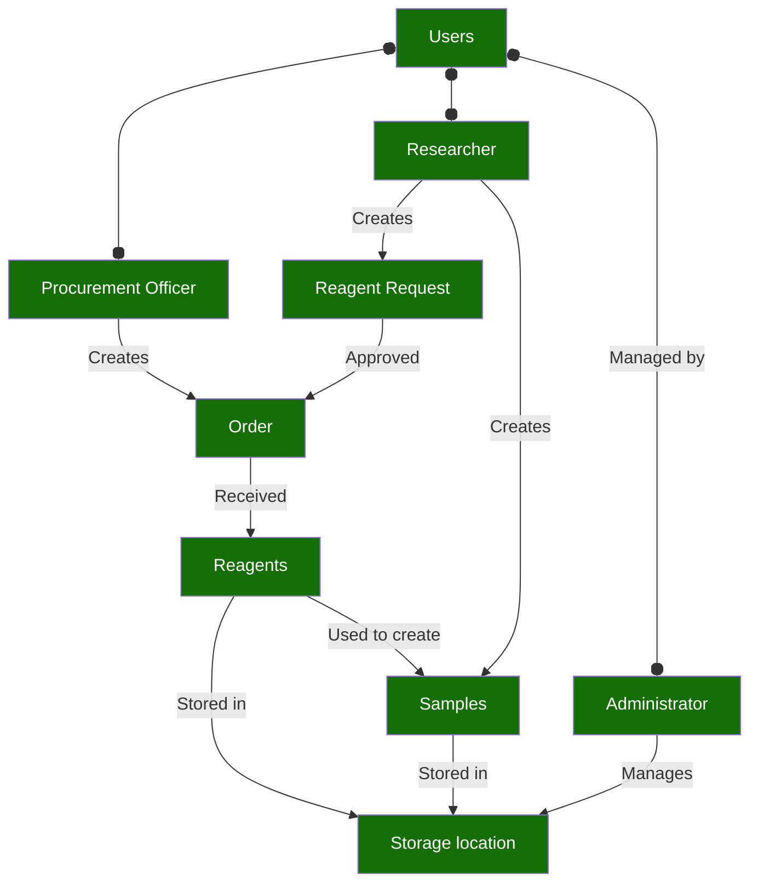

# Frontend Documentation

## Overview

This project is designed to manage users, reagents, samples, requests, orders, storage locations within a laboratory setting. It supports various user roles, each with distinct functionalities. The frontend is built using React and Redux Toolkit for state management, along with MUI for the UI components and RTK Query for data fetching and caching.

## Table of Contents
- [Getting Started](#getting-started)
- [Tools and Technologies](#tools-and-technologies)
- [Diagrams](#diagrams)

## Getting Started

1. Clone the repo to your local machine.
2. Make sure you have Node.js >= 20 and NPM >= 10 installed globally.
3. Install all necessary dependencies via `npm ci` command.
4. Create `.env.local` file using `.env.example` as an example.

### Local environment (frontend)

| command | description |
| ------ | ------ |
|`npm run dev`| to run local dev server. Dev server is setup to use 3000 port.|
|`npm run build`| to build a bundle.|
|`npm run preview`| to start the bundled app you have built.|
|`npm run typecheck`| to check types via Typescript compiler.|
|`npm run lint`| to run linter check.|
|`npm run lint:fix`| to fix reported problems automatically where possible.|
|`npm run stylelint`| to run linter check for stylesheets.|
|`npm run stylelint:fix`| to fix problems in stylesheets automatically where possible.|

### Local environment (backend)

To run backend app locally:
1. Clone this repo: [link](https://github.com/Quantori-Academy/apt-backend)
2. Follow the steps: [link](https://github.com/Quantori-Academy/apt-backend/blob/main/README.md)

## Tools and Technologies

This project utilizes the following tools and libraries:

- **React** for building the user interface.
- **Redux Toolkit** for state management and handling asynchronous logic.
- **RTK Query** for data fetching and caching.
- **React Router** for handling navigation and protected routes.
- **TypeScript** for static typing.
- **MUI** for building responsive, accessible, and modern UI components.
- **Smiles Drawer** for parsing and rendering SMILES strings into graphical representations of chemical structures.
- **Vite** for fast builds and hot module replacement during development.
- **React-i18n** for handling app localization and supporting multiple languages.

## Diagrams

- **Role-Based Permissions**: Illustrates the key features of the system based on different user roles. Each role is assigned specific responsibilities across various management areas such as User Management, Storage Management, Reagent Request Management, Order Management, and Reagents and Samples Management.

```mermaid
%%{init: { "themeVariables": { "fontSize": "16px", "nodeFontWeight": "bold" }}}%%
graph LR;
    %% Priorities
    %% MH[Must have]
    %% SH[Should have]
    %% CH[Could have]

    %% User Authentication
    Authentication{{Authentication}} --> User
    User((Any Role)) -->Login(Login)
    %% User --> ResetPass(Reset password)


    %% User Management
    UM{{User Management}} --> AdminUM
    UM --> UserUM
    AdminUM((Admin)) -->UsersList(See users list)
    AdminUM --> CreateUsers(Add users)
    AdminUM --> ChangeUserInfo(Change profile info)
    AdminUM --> DeleteUsers(Delete users)
    UserUM((Any Role)) --> SeeAndEditUM(See and edit own profile )


    %% Storage Management
    SM{{Storage Management}} --> AdminSM((Admin))
    SM-->UserSM
    AdminSM --> AddSM(Add storage location)
    AdminSM --> EditSM(Edit storage location)
    AdminSM -->DeleteSM(Delete storage location)
    UserSM((Any Role)) --> ViewSMContent(View the reagents of each storage location)
    SM -->UserSMResOfficer
    UserSMResOfficer((Any Role)) --> MoveSMItems(Move items between storage locations)

    %% Reagent Request Management
    RRM{{Reagent Request Management}} --> ResearcherRRM((Researcher))
    ResearcherRRM --> CreateRequestRRM(Create a new reagent request)
    ResearcherRRM --> StatusRequestRRM(See his reagent request status)
    RRM --> OfficerRRM((Procurement officer))
    OfficerRRM --> ConsolidateRRM(Consolidate the requests and create orders to purchase the reagents)
    OfficerRRM --> ViewRRM(View all reagent requests)
    OfficerRRM --> ManageRRM(Decline requests with a comment)

    %% Order Management
    OM{{Order Management}} --> OfficerOM((Procurement officer))
    OfficerOM-->ViewOrdersRRM(View existing orders)
    OfficerOM-->EditOrderRRM(Edit existing orders)
    OfficerOM-->AllocateRRM(Allocates ordered reagents to their designated storage locations)
    OfficerOM-->MarkRRM(Mark an order as completed when the reagents have been received and stored)

    %% Reagents and samples management
    RSM{{Reagents and samples management}} --> UserRSMQ((Any Role))
    RSM-->UserRSMR((Researcher))

    UserRSMQ --> SeeReagentsSamples(See reagents and samples list)
    UserRSMR --> AddReagentsSamples(Add reagents in the system)
    UserRSMR --> EditReagentsSamples(Edit reagents in the system)

















    %% Applying role class
    class AdminUM,AdminSM admin;
    class OfficerRRM,OfficerOM officer;
    class ResearcherRRM,UserRSMR researcher;
    class User,UserUM,UserSM,UserRSM,UserSMResOfficer,UserRSMQ user;

    %% Applying priority class
    class Login,CreateUsers,UsersList,SeeAndEditUM,ChangeUserInfo,MH,DeleteUsers,AddSM,EditSM,DeleteSM,ViewSMContent,MoveSMItems,CreateRequestRRM,StatusRequestRRM,ConsolidateRRM,AllocateRRM,ManageRRM,ViewRRM,ViewOrdersRRM,EditOrderRRM,MarkRRM,SeeReagentsSamples,AddReagentsSamples,EditReagentsSamples must;
    class ResetPassUM,SH should;
    class ResetPass,CH could;

    %% Define the role class
    classDef user fill:#3498DB,stroke:#ccc,color:white,stroke-width:2px;
    classDef admin fill:#2C3E50 ,color:white,stroke:#ccc,stroke-width:2px;
    classDef officer fill:#F1C40F,color:white,stroke:#ccc,stroke-width:2px;
    classDef researcher fill:#8E44AD,color:white,stroke:#ccc,stroke-width:2px;

    %% Define the priority class
    classDef must fill:brown,stroke:#000,color:white,stroke-width:2px;
    classDef should fill:#F39C12,stroke:#c4c4c4,color:black,stroke-width:2px;
    classDef could fill:#2ECC71,stroke:#ccc,color:white,stroke-width:2px;
```




- **Business Entities Diagram**: Represents the core business entities and their relationships within the system.




- **Database Diagram**: Illustrates the key entities and relationships in our database.

```erDiagram
    ROLE {
        enum Administrator
        enum Procurement_Officer
        enum Researcher
    }

    USER_STATUS {
        enum Active
        enum Password_Reset
        enum Pre_Locked
        enum Locked
    }

    COMPOUND {
        enum Reagent
        enum Sample
    }

    REQUEST_STATUS {
        enum Pending
        enum Ordered
        enum Declined
        enum Completed
        enum Taken
    }

    ORDER_STATUS {
        enum Pending
        enum Cancelled
        enum Submitted
        enum Fulfilled
    }

    SUBSTANCE {
        int id PK "Unique identifier for each reagent"
        varchar name "Name of the reagent"
        text description "Description of the reagent"
        text structure "Unique structure of the reagent"
        COMPOUND category "Category of the substance"
        date expiration_date "Expiration date of the substance"
        boolean is_expired "Indicates if the substance is expired"
    }

    STORAGE {
        int id PK "Unique identifier for each storage location"
        varchar room "Room where reagents are stored"
        text description "Description of the storage room"
    }

    STORAGE_LOCATION {
        int id PK "Unique identifier for each storage location"
        int room_id FK "References the storage room"
        varchar location "Specific location within the storage room"
    }

    STORAGE_CONTENT {
        int id PK "Unique identifier for each storage content entry"
        int location_id FK "References the specific storage location"
        int substance_id FK "References the reagent being stored"
        int quantity_left "Quantity of the substance left in stock"
        varchar unit "Measurement unit"
        numeric price_per_unit "Price per unit of the substance"
    }

    USERS {
        int id PK "Unique identifier for each user"
        varchar username "Unique username for each user"
        varchar first_name "First name of the user"
        varchar last_name "Last name of the user"
        varchar email "Email address of the user"
        char password_hash "Hashed password of the user"
        ROLE role "Role of the user in the system"
        USER_STATUS status "Indicates user's account status"
        timestamp created_at "Creation timestamp"
        timestamptz last_login "Timestamp of last login"
    }

    REAGENT {
        int substance_id PK "Reference to specific chemical substance"
        varchar cas_number "CAS number of the reagent"
        varchar producer "Producer of the reagent"
        int catalog_id "ID in producer's catalog"
        text catalog_link "Catalog page link for the reagent"
    }

    SAMPLE {
        int substance_id FK "Reference to specific chemical substance"
        int added_substance_id FK "Added chemical to the sample"
        int added_substance_quantity "Amount of the substance added to given sample"
    }

    REAGENT_REQUEST {
        uuid id PK "Unique identifier for each request"
        int created_by FK "Id of user who created the request"
        varchar reagent_name "Name of the reagent"
        text structure "Unique structure of the reagent"
        varchar cas_number "CAS number of the reagent"
        int quantity "Quantity of the requested reagent"
        varchar unit "Measurement unit for quantity"
        REQUEST_STATUS status "Status of the request"
        timestamp created_at "Creation timestamp"
        timestamp modified_at "Modification timestamp"
    }

    REAGENT_REQUEST_COMMENT {
        uuid id PK "Unique identifier for each request comment"
        uuid request_id FK "Reference to specific reagent request"
        int commenter_id FK "Id of the commenter"
        text comment_text "Content of comment"
    }

    REAGENT_ORDER {
        uuid id PK "Unique identifier for each order"
        int created_by FK "User who created the order"
        varchar title "Title of the order"
        varchar seller "Name of the seller"
        ORDER_STATUS status "Current status of the order"
        uuid request_id FK "Reference to request (if applicable)"
        timestamp created_at "Creation timestamp"
        timestamp modified_at "Modification timestamp"
    }

    REAGENT_ORDER_ITEM {
        int id PK "Unique identifier for each order item"
        uuid order_id FK "Identifier of the order"
        varchar reagent_name "Name of the reagent"
        text structure "Unique structure of the reagent"
        varchar cas_number "CAS number of the reagent"
        varchar producer "Producer of the reagent"
        int catalog_id "ID in producer's catalog"
        text catalog_link "Catalog link"
        int quantity "Quantity of the reagent ordered"
        varchar unit "Measurement unit"
        numeric price_per_unit "Price per unit of the reagent"
    }

    USERS ||--o{ STORAGE : "have access to"
    STORAGE ||--o{ STORAGE_LOCATION : "has"
    STORAGE_LOCATION ||--o{ STORAGE_CONTENT : "contains"
    SUBSTANCE ||--o{ STORAGE_CONTENT : "stored_in"
    USERS ||--o{ REAGENT_REQUEST : "created_by"
    REAGENT_REQUEST ||--o{ REAGENT_REQUEST_COMMENT : "has"
    USERS ||--o{ REAGENT_REQUEST_COMMENT : "commented_by"
    USERS ||--o{ REAGENT_ORDER : "created_by"
    REAGENT_ORDER ||--o{ REAGENT_ORDER_ITEM : "includes"
    SUBSTANCE ||--|| REAGENT : "is_a"
    SUBSTANCE ||--|| SAMPLE : "is_a"
    REAGENT_ORDER ||--|o REAGENT_REQUEST : "from"
    REAGENT_ORDER ||--o{ ORDER_STATUS : "has"
    REAGENT_REQUEST ||--o{ REQUEST_STATUS : "has"
    USERS ||--o{ROLE: "have"
    USERS ||--o{USER_STATUS: "have"
    SUBSTANCE ||--o{COMPOUND: "is"
```

